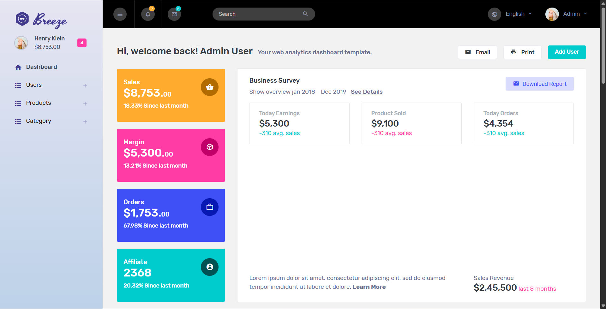
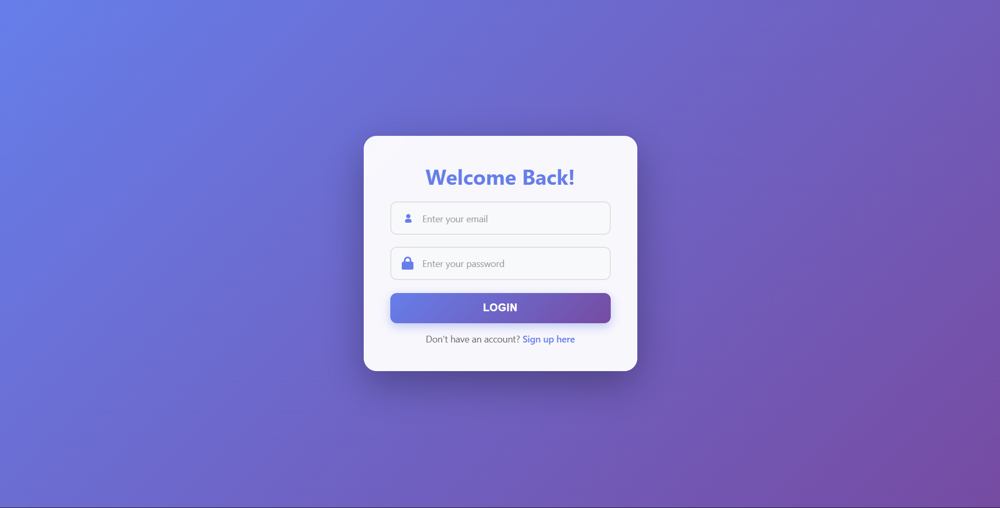
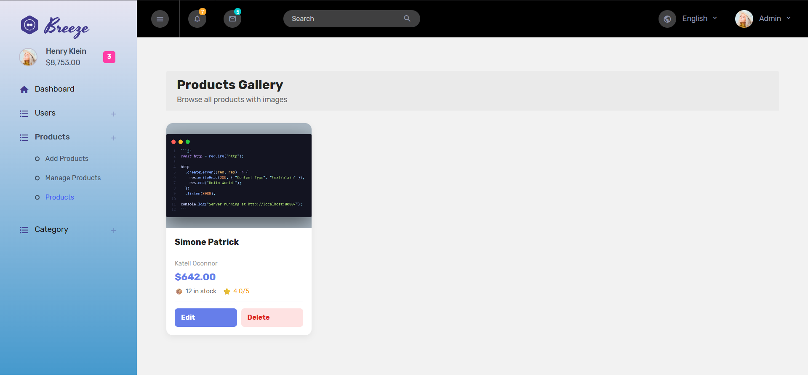
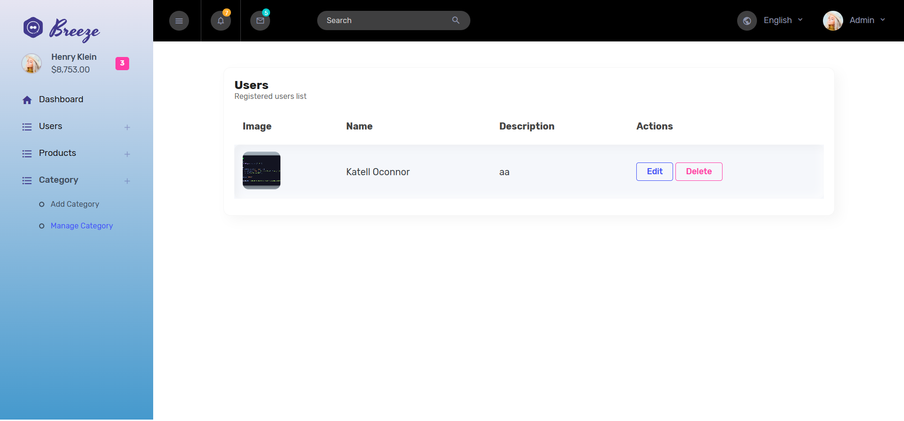
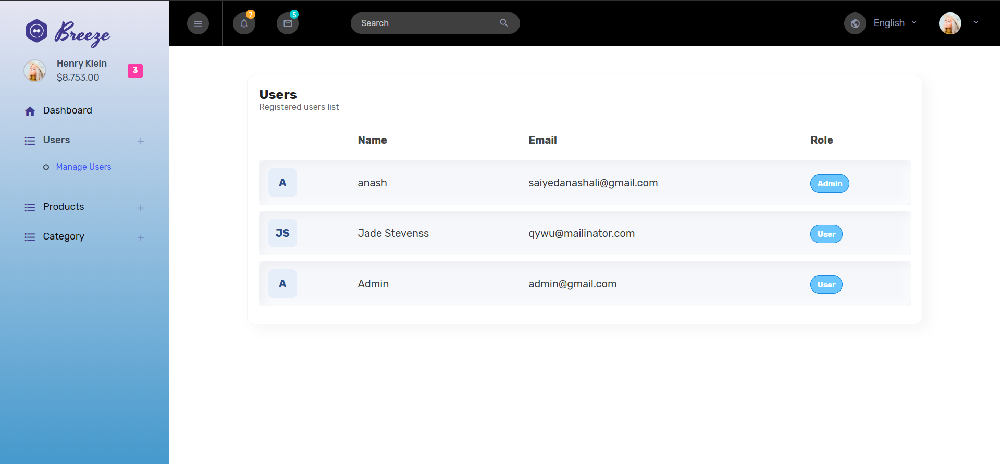
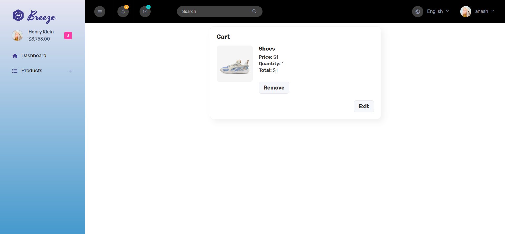

# 📦 Product & Category Management Admin Dashboard

A modern, feature-rich admin dashboard for managing products, categories, and users with JWT authentication, image uploads via Cloudinary, and a sleek neomorphic UI.

Use these credentials to test the application:

| Field | Value |
|-------|-------|
| **Email** | admin@gmail.com |
| **Password** | 1234 |

*Cart Will Work Only For Users*

## 🌐 Live Link
**[View Live Demo](https://node-pr-pms.vercel.app/)**

---

## ✨ Features

- 🔐 **JWT Authentication** - Secure login/signup with token-based authentication
- 👥 **User Management** - Create, view, edit, and delete users
- 📦 **Product Management** - Full CRUD operations for products with pricing and stock tracking
- 🏷️ **Category Management** - Organize products into categories
- 🖼️ **Cloudinary Integration** - Cloud-based image hosting and management
- 🎨 **Modern UI** - Neomorphic design with gradient accents and responsive layout
- 📱 **Responsive Design** - Mobile-friendly interface
- 🔄 **Real-time Updates** - Express.js with EJS templating
- 🛡️ **Password Security** - Bcrypt hashing and change password functionality

---

## 🛠️ Tech Stack

**Backend:**
- Node.js (ES Modules)
- Express.js
- MongoDB with Mongoose
- Bcrypt (password hashing)
- JWT (authentication)
- Multer + Cloudinary (image uploads)

**Frontend:**
- EJS Templating
- Bootstrap 4
- Custom CSS (Neomorphic design)
- Responsive Grid Layouts

**Hosting:**
- Cloudinary (image storage)

---

## 📋 Prerequisites

- Node.js (v14 or higher)
- MongoDB (local or Atlas)
- Cloudinary account
- npm or yarn

---

## 🚀 Installation & Setup

1. **Clone the repository**
   ```bash
   git clone https://github.com/anashali01/Node_Final_Exam.git
   cd Node_Final_Exam
   ```

2. **Install dependencies**
   ```bash
   npm install
   ```

3. **Create `.env` file** in the root directory
   ```env
   MONGODB_URI=mongodb://localhost:27017/exam_db
   JWT_SECRET=your_secret_key_here
   CLOUDINARY_NAME=your_cloudinary_name
   CLOUDINARY_API_KEY=your_cloudinary_api_key
   CLOUDINARY_API_SECRET=your_cloudinary_api_secret
   PORT=3000
   ```

4. **Start the server**
   ```bash
   npm start
   ```
   Or with nodemon (for development):
   ```bash
   npm run dev
   ```

5. **Access the application**
   - Open your browser and go to `http://localhost:3000`

---

## 🔑 Demo Credentials


Or create your own account using the **Sign Up** page.

---

## 📁 Project Structure

```
├── config/
│   ├── db.js              # MongoDB connection
│   ├── dotenv.js          # Environment variables
│   └── cloudinary.js      # Cloudinary configuration
├── controller/
│   └── dashboardCtl.js    # Main controller (auth, users, passwords)
├── middleware/
│   ├── dashboardAuth.js   # JWT verification
│   └── upload.js          # Multer & Cloudinary setup
├── model/
│   ├── user.model.js      # User schema
│   ├── product.model.js   # Product schema
│   └── category.model.js  # Category schema
├── routers/
│   ├── dashboardRouter.js # Auth & user routes
│   ├── productRouter.js   # Product CRUD routes
│   ├── categoryRouter.js  # Category CRUD routes
│   └── index.js           # Router consolidation
├── views/
│   ├── pages/             # Page templates
│   └── partials/          # Reusable components
├── public/                # Static files (CSS, JS, images)
├── index.js               # Main server file
└── package.json           # Dependencies
```

---

## 🎯 Core Features Breakdown

### Authentication
- **Sign Up** - Register new admin users with bcrypt password hashing
- **Login** - JWT token generation and cookie storage
- **Logout** - Token invalidation
- **Change Password** - Secure password updates with confirmation

### User Management
- **View Users** - Table view of all registered users
- **Edit User** - Update user details (name, email)
- **Delete User** - Remove users from the system

### Product Management
- **Add Product** - Create products with name, description, price, stock, rating, and category assignment
- **View Products** - Two views: table and card gallery
- **Edit Product** - Modify product details and images
- **Delete Product** - Remove products
- **Image Upload** - Cloudinary integration for product images

### Category Management
- **Add Category** - Create categories with image upload
- **View Categories** - Browse all product categories
- **Edit Category** - Update category information
- **Delete Category** - Remove categories

---

## 🖼️ Screenshots

### Dashboard


### Login Page


### Sign Up Page


### Product Management


### Category Management


### User Management

### Cart


---

## 📝 API Routes

### Authentication
- `GET /signup` - Sign up page
- `POST /signup` - Register user
- `GET /login` - Login page
- `POST /login` - Authenticate user
- `GET /logout` - Clear session

### Dashboard (Protected)
- `GET /` - Dashboard home

### User Routes (Protected)
- `GET /viewUsers` - View all users
- `GET /edit/:id` - Edit user page
- `POST /edit/:id` - Update user
- `GET /delete/:id` - Delete user
- `GET /changePassword` - Change password page
- `POST /changePassword` - Update password

### Product Routes (Protected)
- `GET /addProducts` - Add product page
- `POST /addProducts` - Create product (with image upload)
- `GET /products` - View all products
- `GET /edit-product/:id` - Edit product page
- `POST /edit-product/:id` - Update product (with image upload)
- `GET /delete-product/:id` - Delete product

### Category Routes (Protected)
- `GET /addCategory` - Add category page
- `POST /addCategory` - Create category (with image upload)
- `GET /viewCategories` - View all categories
- `GET /edit-category/:id` - Edit category page
- `POST /edit-category/:id` - Update category (with image upload)
- `GET /delete-category/:id` - Delete category

---

## 🔐 Security Features

- ✅ JWT token-based authentication
- ✅ Bcrypt password hashing
- ✅ HTTP-only cookies for token storage
- ✅ Protected routes with middleware
- ✅ User ID verification on password changes
- ✅ Password confirmation validation

---

## 🚀 Future Enhancements

- [ ] Search and filter functionality
- [ ] Pagination for large datasets
- [ ] Dashboard analytics and statistics
- [ ] Email notifications
- [ ] Product reviews and ratings
- [ ] Inventory alerts
- [ ] Export to CSV/PDF
- [ ] Two-factor authentication

---

## 🐛 Troubleshooting

### MongoDB Connection Issues
- Ensure MongoDB is running locally or Atlas connection string is correct
- Check `.env` file for `MONGODB_URI`

### Cloudinary Upload Failures
- Verify Cloudinary credentials in `.env`
- Check file size limits (max 10MB default)
- Ensure file format is supported (JPG, PNG, WebP)

### JWT Authentication Errors
- Clear browser cookies and log in again
- Verify `JWT_SECRET` is set in `.env`
- Check token expiration

### Image Not Displaying
- Verify Cloudinary folder path: `exam/images`
- Check image URLs in database
- Ensure Cloudinary account is active

---

## 📧 Contact & Support

For issues or questions, please reach out or open an issue in the repository.

---

## 📄 License

This project is licensed under the MIT License - see the LICENSE file for details.

---

**Made with ❤️ by Anas Ali**